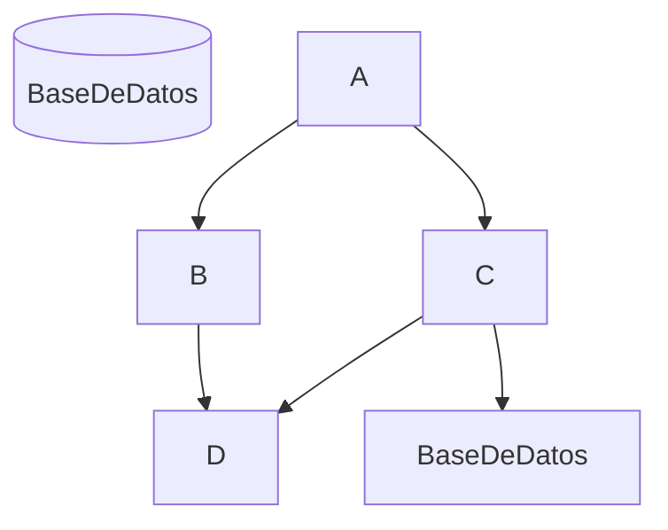

# README

## Modificacion de un Readme

 Vamos a crear un Readme que contenga todos los componentes de esta guia [Como escribir en Markdown](https://docs.github.com/es/get-started/writing-on-github/getting-started-with-writing-and-formatting-on-github/basic-writing-and-formatting-syntax). 

 Cuando querramos resaltar un texto podremos hacerlo de maneras distintas:
 - `De esta forma` por ejemplo

### Incluso, podemos introducir imagenes o diagramas para hacer mas legible y accesible nuestra informacion.

* Deberes que hacer

* Lista de la compra
  
  - No comparte su comida

  - Abracin es solo suyo

- [x] Examen de SI
- [ ] Examen de FOL
- [x] Examen XML

Incluso podemos introducir diagramas como este: 

